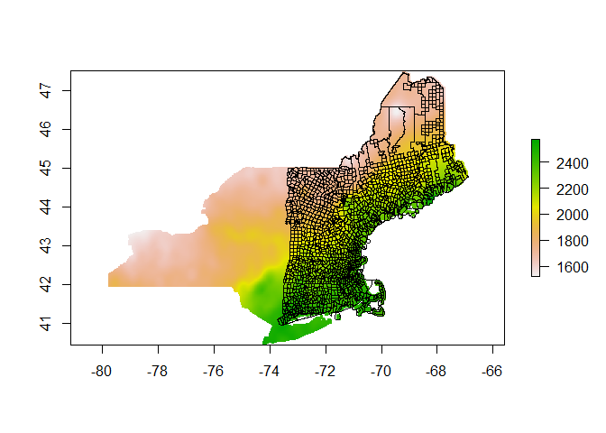

Get extreme rainfall prediction data for epa region 01 county
subdivisions
================
2019-10-01

  - [Description](#description)
  - [Load packages](#load-packages)
  - [Load data](#load-data)
  - [Extract](#extract)
  - [Export](#export)

### Description

Get an environmental dataset that can be joined to
epa01\_cosub2018.geojson

Data sources:

1.  center coordinates from data/epa01\_cosub2018.geojson
2.  download from [spatial grid: extreme rainfall
    projections](http://precip.eas.cornell.edu/)

Coding outline:

1.  Load and view spatial (vector and grid) data
2.  Extract grid data and export it

### Load packages

``` r
library(dplyr)
```

    ## 
    ## Attaching package: 'dplyr'

    ## The following objects are masked from 'package:stats':
    ## 
    ##     filter, lag

    ## The following objects are masked from 'package:base':
    ## 
    ##     intersect, setdiff, setequal, union

``` r
library(readr)
library(raster)
```

    ## Loading required package: sp

    ## 
    ## Attaching package: 'raster'

    ## The following object is masked from 'package:dplyr':
    ## 
    ##     select

``` r
library(sf)
```

    ## Linking to GEOS 3.6.1, GDAL 2.2.3, PROJ 4.9.3

### Load data

``` r
epa01_cosub2018 <- 
  st_read("../../data/epa01_cosub2018.geojson", 
          stringsAsFactors = FALSE)
```

    ## Reading layer `epa01_cosub2018' from data source `C:\Users\Jim\GitHub\spatial\data\epa01_cosub2018.geojson' using driver `GeoJSON'
    ## Simple feature collection with 1618 features and 21 fields
    ## geometry type:  MULTIPOLYGON
    ## dimension:      XY
    ## bbox:           xmin: -73.72777 ymin: 40.95094 xmax: -66.88544 ymax: 47.45985
    ## epsg (SRID):    4269
    ## proj4string:    +proj=longlat +ellps=GRS80 +towgs84=0,0,0,0,0,0,0 +no_defs

``` r
tmpdir <- tempdir()
unzip(zipfile = "../../data/raster/asc/rpe_1d_1y.zip", exdir = tmpdir)

rpe_1d_1y <- raster(paste0(tmpdir, "/rpe_1d_1y.asc")) %>% 
  readAll()

rpe_1d_1y
```

    ## class      : RasterLayer 
    ## dimensions : 846, 1547, 1308762  (nrow, ncol, ncell)
    ## resolution : 0.008333333, 0.008333333  (x, y)
    ## extent     : -79.8, -66.90833, 40.45833, 47.50833  (xmin, xmax, ymin, ymax)
    ## crs        : NA 
    ## source     : memory
    ## names      : rpe_1d_1y 
    ## values     : 1523, 2575  (min, max)

``` r
plot(rpe_1d_1y)
plot(st_geometry(epa01_cosub2018), add = TRUE)
```

<!-- -->

``` r
epa01_cosub2018pts <- epa01_cosub2018 %>% 
  mutate(INTPTLAT = as.numeric(INTPTLAT),
         INTPTLON = as.numeric(INTPTLON)) %>% 
  st_drop_geometry() %>% 
  dplyr::select(GEOID, INTPTLAT, INTPTLON)

head(epa01_cosub2018pts)
```

    ##        GEOID INTPTLAT  INTPTLON
    ## 1 0900962290 41.49925 -72.97563
    ## 2 0900914160 41.51183 -72.90362
    ## 3 0900919550 41.32612 -73.08257
    ## 4 0900922910 41.29345 -72.85899
    ## 5 0900322070 41.92972 -72.74538
    ## 6 0900322630 41.76070 -72.60765

### Extract

``` r
locations_rpe_1d_1y <-
  extract(x = rpe_1d_1y,
          y = epa01_cosub2018pts[, c("INTPTLON", "INTPTLAT")],
          method = "bilinear")

epa01_cosub2018_df <- 
  data.frame(epa01_cosub2018pts, rpe_1d_1y = locations_rpe_1d_1y)

head(epa01_cosub2018_df)
```

    ##        GEOID INTPTLAT  INTPTLON rpe_1d_1y
    ## 1 0900962290 41.49925 -72.97563  2469.424
    ## 2 0900914160 41.51183 -72.90362  2477.985
    ## 3 0900919550 41.32612 -73.08257  2493.453
    ## 4 0900922910 41.29345 -72.85899  2468.158
    ## 5 0900322070 41.92972 -72.74538  2326.785
    ## 6 0900322630 41.76070 -72.60765  2306.926

### Export

``` r
epa01_cosub2018_df %>% 
  write_csv("../../data/epa01_cosub2018_rain.csv")
```
